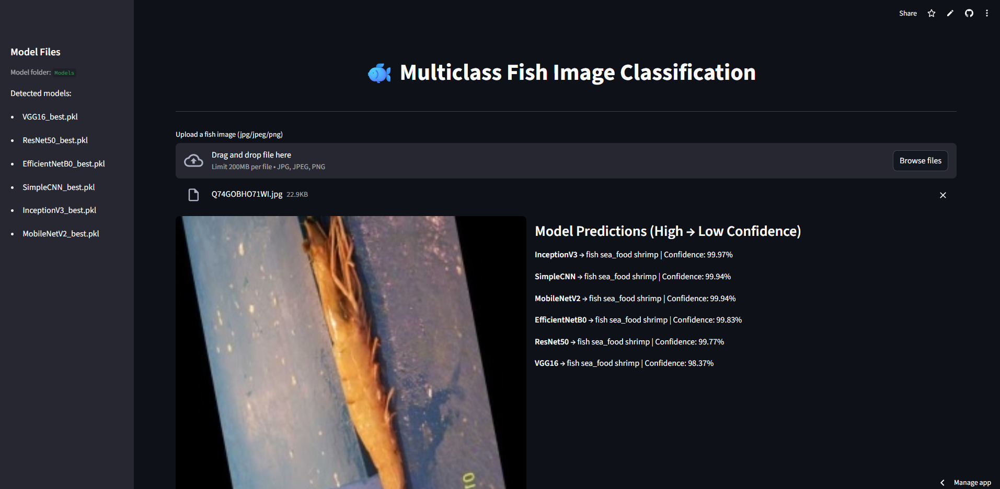

# 🐟 Multiclass Fish Image Classification

## ⚙️ Workflow
1. Data Preprocessing & Augmentation

    - Rescale fish images to the [0,1] range.
    - Apply data augmentation (rotation, zoom, flipping) to increase robustness.
    - Load dataset using TensorFlow’s ImageDataGenerator for efficient processing.

2. Model Training

    - Train a CNN model from scratch.
    - Experiment with five pre-trained models: VGG16, ResNet50, MobileNet, InceptionV3, EfficientNetB0.
    - Fine-tune pre-trained models on the fish dataset.
    - Save the best-performing model in .h5 or .pkl format.
  
3. Model Evaluation

    - Compare metrics across all models: accuracy, precision, recall, F1-score.
    - Generate confusion matrices.
    - Visualize training history (accuracy & loss) for each model.
  
4. Streamlit Application

    - Upload fish images for real-time prediction.
    - Display predicted fish category.
    - Provide model confidence scores.
  
5. Documentation & Deliverables

    - Well-documented GitHub repository.
    - Comparison report of all models.
    - Trained models (.h5/.pkl).
    - Streamlit app for deployment.
  
## ▶️ Running the App

Ensure Python 3.8+ is installed.

1. Clone the repo:
   
       https://github.com/Arjun-Karthik/Multiclass_Fish_Image_Classification
       cd Multiclass_Fish_Image_Classification

2.Install dependencies

       pip install -r requirements.txt

3. Run Streamlit app

       streamlit run app.py

4. Upload a fish image and get prediction with model confidence.

## 🧩 Features

   - Multi-class fish species classification.
   - Real-time predictions with confidence scores.
   - Comparison of CNN (scratch) vs transfer learning models.
   - Training & evaluation history visualization.
   - Deployment-ready Streamlit app.

## ✅ Requirements

   - torch
   - torchvision
   - scikit-learn
   - matplotlib
   - pandas
   - Pillow
   - streamlit
   - plotly

Install all with:

       pip install -r requirements.txt

## 📸 Screenshots

### Dashboard

### 📊 Model Performance

## 🎥 Demo Video

   <a href="https://www.linkedin.com/posts/arjun-t-a51383200_multiclass-fish-image-classification-trained-activity-7362341996092420097-ECQb?utm_source=share&utm_medium=member_desktop&rcm=ACoAADNQBh0BQsEphYCjQb01l17Z8-pUyINZuxs">Multiclass Fish Image Classification Demo Video</a>

## 📃 License

   This project is licensed under the MIT License – see the LICENSE file for details.
